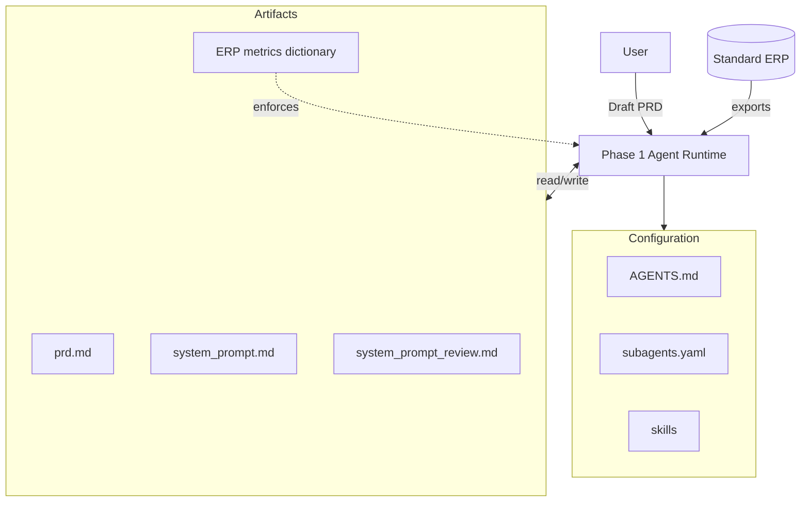

# Module 3：Phase 1（ERP-only）运营数据分析 Agent

本模块定义了 Phase 1 的范围：以 **标准 ERP** 为唯一数据源（ERP-only），为"运营数据分析 Agent"产出可执行的系统提示词与配套产物。

## Phase 1 目标

构建一个单一 Agent，完成以下能力：

1. 读取客户已写好的 PRD（`artifacts/prd.md`）
2. 基于 PRD 内容生成系统提示词（Phase 1 = ERP-only）
3. 强制使用指标口径字典（如存在），并在分析输出中注明口径版本号

Phase 1 暂不生成用户需求文档、技术设计文档或项目计划，这些属于 Phase 2。

## 核心流程

```text
客户写好 PRD (artifacts/prd.md)
-> Agent 读取 PRD
-> Agent 生成系统提示词
-> Agent 评审系统提示词
```

## 输出产物

Phase 1 建议输出以下文件：

- `artifacts/system_prompt.md`
- `artifacts/ERP_指标口径字典模板.md`
- `artifacts/system_prompt_review.md`

**注意：`artifacts/prd.md` 是客户输入，Agent 只读取不写入。**

## 必须遵守的规则

- 不允许臆造缺失的业务约束
- 必须以 PRD 作为系统提示词生成的唯一事实来源
- 系统提示词生成后必须执行一次结构化评审
- Phase 1 只允许使用 ERP 数据（ERP-only），不得默认引入 CRM/HR/生产等外部系统

## Architecture

完整架构图见：[architecture.md](file:///Users/weiping/dev/Learn/langchain-ai/deep_agent_0530/notebooks/module-3/architecture.md)



## 对应 Deep Agents 的结构建议

- `AGENTS.md`
  - 产品设计 Agent 的全局行为规则
- `skills/prd-intake/SKILL.md`
  - 负责 PRD 读取与理解
- `skills/system-prompt-generator/SKILL.md`
  - 负责基于 PRD 生成系统提示词
- `skills/reviewer/SKILL.md`
  - 负责检查完整性与一致性
- `subagents.yaml`
  - 可选的专家角色，例如 `clarifier`、`prompt-architect`、`reviewer`

## 本模块当前文件

- `README.md`
  - Phase 1 的高层设计说明
- `prd_schema.py`
  - 结构化 PRD Schema 与校验辅助函数
- `phase1_prompts.py`
  - PRD 读取、系统提示词生成的提示词模板
- `evaluation_criteria.py`
  - Phase 1 各类产物的评估 Rubric 与评估流程
- `review_prompts.py`
  - PRD、系统提示词的评审 Prompt 模板
- `AGENTS.md`
  - Phase 1 的全局运行规则与阶段边界
- `subagents.yaml`
  - `clarifier`、`prompt-architect`、`reviewer` 等子 Agent 定义
- `phase1_agent.py`
  - Phase 1 的可运行入口脚本
- `skills/`
  - `prd-intake`、`system-prompt-generator`、`reviewer` 三类工作流技能
- `artifacts/`
  - Phase 1 运行时建议写入的产物目录
- `3.0_phase1_agent.ipynb`
  - Phase 1 Agent 的演示 Notebook
- `示例输入.md`
  - 可直接用于测试的中文示例输入
- `产物示例说明.md`
  - 用于说明理想输出产物应具备的结构与质量
- `architecture.md`
  - Mermaid 架构图（组件视图 + 工作流视图）

## Phase 1 评估流程

```text
读取 PRD
-> 检查 PRD 是否完整
-> 生成系统提示词
-> 评估系统提示词
-> 输出最终结果
```

建议所有关键输出都具备以下评估维度：

- 完整性
- 正确性
- 一致性
- 具体性
- 安全性
- 可审查性