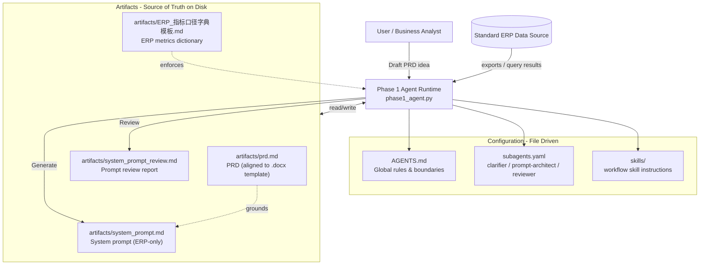
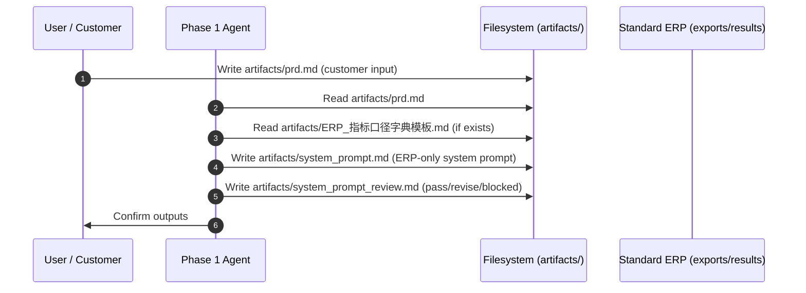
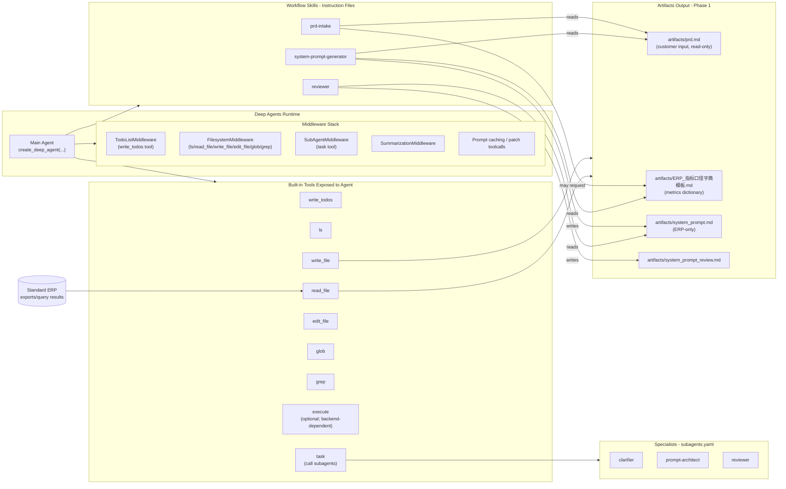

# Phase 1 (ERP-only) Agent Architecture

This diagram explains the Phase 1 architecture in `notebooks/module-3`.

## Component View

## Workflow View (Phase 1)

## Tooling-Level View (Agent / TODO / Tools / Subagents)

This view shows how the Deep Agents runtime is assembled (middleware + tools) and how each element contributes to the end-to-end workflow.

## Key Design Rules (Why This Works)

- PRD is the single source of truth for scope, boundaries, approvals, and fallback behavior.
- Phase 1 is ERP-only: no cross-system joins unless explicitly moved to a later phase.
- The metrics dictionary is mandatory when present: analyses must cite its version and assumptions.
- Review is not optional: every key output should produce a review status (pass/revise/blocked).
